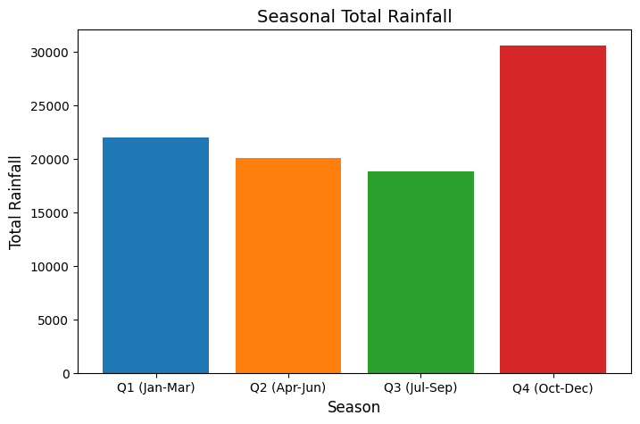

# Project Title: whether_forecast_python

## Introduction

Rainfall patterns play a crucial role in shaping ecosystems, agricultural productivity, water resource management, and urban infrastructure planning. Understanding these patterns, particularly their seasonal and long-term trends, is critical for informed decision-making and sustainable development.

This project analyzes historical rainfall data to uncover trends, identify potential anomalies, and predict future rainfall levels. The primary objectives of this analysis include:

1. **Exploration of Seasonal Patterns**
Grouping the data into quarterly segments (Q1 to Q4) allowed us to investigate seasonal rainfall variations. This helped us pinpoint high and low rainfall periods and examine their consistency over the years.

2. **Year-over-Year Trend Analysis**
We analyzed year-over-year rainfall data to identify long-term trends. Using techniques such as regression analysis, we determined the presence of a negative trend, indicating a decline in total rainfall over the years.

3. **Future Rainfall Prediction**
Leveraging regression and time series techniques, we forecasted rainfall for the next decade. This prediction provides insights into potential future scenarios, enabling better preparedness for resource allocation and planning.

4. **Evaluation Metrics**
To validate the accuracy of the predictions, we calculated metrics such as Mean Absolute Error (MAE), Mean Squared Error (MSE), and the R² score. These metrics helped us assess the reliability of the models used.

5. **Impact Analysis**
We discussed the implications of declining rainfall on agriculture, water management, and other dependent industries, emphasizing the need for adaptive strategies to mitigate potential challenges.

Full report here: [Rainfall_project](/whether_analysis/rain_sg.ipynb)

Dataset:[Rain_dataset](/dataset/Rain_fall_Monthly_Total.csv)

## Background

Rainfall is a vital component of the Earth's hydrological cycle and significantly influences agriculture, water supply, energy production, and urban planning. Over the years, changing climate patterns and human activities have affected rainfall distribution, leading to uncertainties in water availability and increased risks of droughts and floods.

In this project, historical rainfall data serves as the foundation for our analysis. This dataset, which spans multiple years, provides detailed records of rainfall totals, allowing us to investigate trends, seasonal variations, and long-term changes.

### Motivation

Understanding rainfall trends is essential for:

- **Agriculture:** Ensuring food security through better crop planning and irrigation strategies.

- **Water Resource Management:** Preparing for potential shortages or excesses in water supply.

- **Urban Development:** Designing infrastructure resilient to flooding and rainfall variability.

- **Climate Change Mitigation:** Assessing the impact of shifting rainfall patterns on ecosystems and human activities.

### Key Questions Addressed

1. Are there observable trends in rainfall over the years, such as increases or declines?

2. How do seasonal patterns of rainfall vary across different quarters of the year?

3. What can we predict about future rainfall levels, and how reliable are these predictions?

4. What are the implications of the observed and predicted changes in rainfall?

The insights from this analysis aim to aid policymakers, researchers, and planners in making data-driven decisions to address challenges related to rainfall variability and its cascading effects on various sectors.

## Tools

This section outlines the tools and technologies employed to conduct the rainfall analysis efficiently and accurately. Each tool was selected for its specific capabilities to address the analysis objectives.

### Programming Environment:

- **Visual Studio Code (VS Code):** Used as the primary integrated development environment (IDE) for writing, debugging, and managing Python scripts. Its extensibility and support for Python plugins streamlined the coding process.

### Programming Language:

- **Python:** Used for data preprocessing, statistical analysis, and creating visualizations.

### Libraries:

- **Pandas:** For data manipulation and analysis, including handling time series data.

- **NumPy:** To perform mathematical operations, including regression calculations.

- **Matplotlib and Seaborn:** For plotting trends, visualizing seasonal and quarterly patterns, and illustrating the forecasted rainfall data.

- **Scikit-learn:** For machine learning tasks like Decision Tree Regression and calculating evaluation metrics (MAE, MSE, R²).

### Forecasting Techniques:

- **Trend Line Analysis:** A linear regression approach used to identify long-term rainfall trends.

- **Decision Tree Regression:** For exploring relationships and ensuring robust metric evaluations.

### Evaluation Metrics:

- Metrics like **Mean Absolute Error (MAE), Mean Squared Error (MSE)**, and **R²** Score were employed to assess the accuracy and reliability of the predictions.

### Database:

- **Rain**: A structured database created to hold rainfall data for efficient querying and processing.

## The Analysis

This section delves into the methods and processes undertaken during the rainfall analysis. The primary objective was to uncover patterns, trends, and predictions related to rainfall over the years.

### Seasonal/Quarterly

- Gives a broader perspective by summarizing data into seasons (e.g., wet season vs. dry season).
- Useful for comparing overall seasonal impacts or understanding large-scale weather patterns.

**Step 1: Define Quarters**

- Q1: January–March
- Q2: April–June
- Q3: July–September
- Q4: October–December

**Step 2: Create a New Column**

- We will add a column Quarter that assigns each month to a specific quarter.

**Step 3: Analyze and Visualize**

- Calculate the total and average rainfall for each quarter.
- Create a bar chart to compare quarterly rainfall trends.


```py
# Assuming 'Rain' is your dataframe with columns: 'month', 'total rainfall'
# Creating a new 'quarter' column based on the 'month' column
Rain['quarter'] = pd.to_datetime(Rain['month'], format='%Y-%m').dt.quarter

# Summarizing rainfall data by quarters
seasonal_rainfall = Rain.groupby('quarter')['total rainfall'].sum().reset_index()

# Adding a descriptive label for each quarter
seasonal_rainfall['season'] = seasonal_rainfall['quarter'].replace({
    1: 'Q1 (Jan-Mar)',
    2: 'Q2 (Apr-Jun)',
    3: 'Q3 (Jul-Sep)',
    4: 'Q4 (Oct-Dec)'
})

# Display the seasonal rainfall summary
print(seasonal_rainfall)

# Visualization
import matplotlib.pyplot as plt

plt.figure(figsize=(8, 5))
plt.bar(seasonal_rainfall['season'], seasonal_rainfall['total rainfall'], color=['#1f77b4', '#ff7f0e', '#2ca02c', '#d62728'])
plt.title('Seasonal Total Rainfall', fontsize=14)
plt.xlabel('Season', fontsize=12)
plt.ylabel('Total Rainfall', fontsize=12)
plt.show()
```



| Quarter | Total Rainfall | Season |
|---|---|---|
| 1 | 22000 | Q1 (Jan-Mar) |
| 2 | 20038 | Q2 (Apr-Jun) |
| 3 | 18776 | Q3 (Jul-Sep) |
| 4 | 30549 | Q4 (Oct-Dec) |

The bar chart titled "Seasonal Total Rainfall" shows the total rainfall distribution across the four quarters (or seasons) of the year. Here's the breakdown:

- **Q1 (Jan-Mar):** This quarter has a significant amount of rainfall, indicating it could be part of a wet season or transitional period in your region.

- **Q2 (Apr-Jun):** Rainfall decreases slightly compared to Q1, suggesting a drier season or a less intense wet season during these months.

- **Q3 (Jul-Sep):** The rainfall remains consistent with Q2, further supporting a relatively stable or dry season during this quarter.

- **Q4 (Oct-Dec):** This quarter has the highest total rainfall, possibly indicating it falls during the peak of the wet or monsoon season.

**Observations:**

- **Seasonal Trends:** There’s a clear seasonal pattern where rainfall is highest in Q4 and lowest in Q3.
- **Impact of Q4:** The significant peak in Q4 might require additional attention to understand factors like extreme weather events or monsoons.


### Analyze the Rainfall Trend

**Aggregate Total Rainfall by Year:**

- Calculate the total rainfall for each year by summing up the rainfall data across all seasons.

**Create a Line Plot:**

- Plot the total yearly rainfall as a line graph to visually observe the trend (e.g., incline or decline).

**Apply a Trend Line:**

- Use a linear regression model to fit a line to the yearly total rainfall.
- This trend line will help indicate whether the rainfall is increasing, decreasing, or remaining stable.

**Calculate the Slope:**

- The slope of the trend line will numerically confirm the direction of the trend:
- Positive Slope: Rainfall is increasing.
- Negative Slope: Rainfall is decreasing.
- Near Zero: Rainfall shows no significant trend.

```py
# Assume 'Rain' is the DataFrame containing rainfall data with 'year' and 'rainfall' columns
# Group by 'year' to get total rainfall per year
yearly_rainfall = Rain.groupby('year')['total rainfall'].sum().reset_index()

# Extract year and total rainfall
x = yearly_rainfall['year']
y = yearly_rainfall['total rainfall']

# Perform linear regression to get the trend line
slope, intercept, r_value, p_value, std_err = linregress(x, y)

# Create the line plot
plt.figure(figsize=(10, 6))
plt.plot(x, y, marker='o', linestyle='-', label='Total Rainfall')
plt.plot(x, intercept + slope*x, color='red', linestyle='--', label=f'Trend Line (Slope: {slope:.2f})')

# Add labels, title, and legend
plt.title('Total Rainfall Trend Over the Years')
plt.xlabel('Year')
plt.ylabel('Total Rainfall')
plt.legend()
plt.grid(True)
plt.show()

# Print the slope to confirm trend direction
print(f"The slope of the trend line is: {slope:.2f}")
if slope > 0:
    print("The trend shows an increase in rainfall over the years.")
elif slope < 0:
    print("The trend shows a decrease in rainfall over the years.")
else:
    print("There is no significant trend in rainfall over the years.")
```


**The slope of the trend line is: -1.68**

The trend shows a decrease in rainfall over the years.

**Explanation of the Graph**

The chart **"Total Rainfall Trend Over the Years"** shows the total annual rainfall plotted against time (in years), with a trend line overlaid to indicate the general direction of the trend.

**Key Observations:**

1. **Total Rainfall Data:**

- The blue line represents the total annual rainfall values for each year. The values fluctuate significantly, showing variability in yearly rainfall.
- Some years experienced sharp spikes or drops in rainfall totals, indicating years of unusually high or low rainfall.

2. **Trend Line:**

- The red dashed line represents the trend of the rainfall data over the years.
- The slope of the line is **-1.68**, which indicates a slight decline in total rainfall over the observed period.

3. **Slope Interpretation:**

- A negative slope means that, on average, the total rainfall has been decreasing slightly over the years.
- While individual years show sharp peaks and troughs, the overall trend is a gradual decline.

**Conclusion:**

Although there are fluctuations in annual rainfall, the long-term trend shows a slight decline in total rainfall over the years, as indicated by the negative slope of the trend line.

##### The slope of the trend line is -1.68

In the context of the trend line:

1. Slope Value:

- The slope of **-1.68 means** that for each passing year, the total annual rainfall decreases by an average of **1.68 units** (e.g., millimeters if that's the unit of measurement in the dataset).
- The negative sign indicates a **downward trend** in rainfall.

2. Trend Line Interpretation:

- A trend line is a linear approximation of the overall direction of the data.
- Here, the downward slope shows that, **over time**, total rainfall has been gradually declining.

3. Practical Implication:

- **A decreasing rainfall trend over the years may suggest:**

- **Long-term climate changes** like rising temperatures or altered weather patterns.
- **Environmental** factors such as deforestation or urbanization.
- Potential impacts on **water resources, agriculture, and ecosystems** if this trend continues.

**Simplified Example:**

If the trend started with a total rainfall of **2000 mm** in 1980:

- By 1981, the predicted rainfall would decrease to **2000 - 1.68 = 1998.32 mm**.
- Over 10 years, the rainfall would decrease by approximately **16.8 mm (1.68 × 10)**.

**Conclusion:**

The slope -1.68 summarizes the rate of decline in rainfall over time, suggesting a consistent but gradual reduction in annual rainfall totals. This finding highlights the need for further investigation into its causes and impacts.

#### predict future rainfall

now lets do predict **future rainfall** using the **trend line** derived from the linear regression. The trend line equation is generally expressed as:

**y=mx+c**

Where:

- y: Predicted total rainfall
- m: Slope of the line (-1.68 in this case)
- x: Year (independent variable)
- c: Intercept of the line (determined from the data)

now use this equation to forecast future rainfall values for upcoming years by substituting the year 
𝑥
x into the equation.

#### Steps for Prediction:

**Use the Trend Line Equation:**

- From the current data, extract the slope (
𝑚
m) and intercept (
𝑐
c).

**Substitute Future Years:**

- Predict rainfall for future years (e.g., 2025, 2030) by substituting the year values into the equation 
𝑦
=
𝑚
𝑥
+
𝑐
y=mx+c.

**Visualize Predictions:**

- Extend the trend line on the existing chart to visualize predictions over future years.

```py
# Example data: slope and intercept from the trend line
slope = -1.68
intercept = 2150  

# Generate years for prediction
current_year = 2024
future_years = np.arange(current_year, current_year + 10)  # Predict next 10 years

# Calculate predicted rainfall
predicted_rainfall = slope * future_years + intercept

# Plot predictions
plt.figure(figsize=(10, 6))
plt.plot(future_years, predicted_rainfall, 'r--', label='Predicted Rainfall')
plt.scatter(future_years, predicted_rainfall, color='red')
plt.title("Predicted Rainfall for Future Years")
plt.xlabel("Year")
plt.ylabel("Total Rainfall")
plt.legend()
plt.show()

# Print predictions
for year, rainfall in zip(future_years, predicted_rainfall):
    print(f"Predicted Rainfall in {year}: {rainfall:.2f}")
```


## Predicted Rainfall

The following are the predicted rainfall values for the next 10 years based on the analysis:

- **2024:** -1250.32  
- **2025:** -1252.00  
- **2026:** -1253.68  
- **2027:** -1255.36  
- **2028:** -1257.04  
- **2029:** -1258.72  
- **2030:** -1260.40  
- **2031:** -1262.08  
- **2032:** -1263.76  
- **2033:** -1265.44  

The results demonstrate a consistent decline in rainfall over the years, as indicated by the negative slope from the trend line.

#### Key Observations:

1. **Negative Slope:**

- The slope of the line is negative, indicating a **continuous decline** in total rainfall over the future years. This aligns with the earlier trend analysis where the slope was approximately **-1.68.**

2. **Rainfall Values:**

- The y-axis represents the total rainfall values.
- The predictions suggest rainfall will gradually decrease as the years progress.

For instance:

- 2024 starts with a rainfall value close to **-1250.**
- By 2033, the rainfall decreases further, nearing **-1265.**

3. **Trend Representation:**

- The **dotted red line** shows the predicted values using the regression model.
- The red dots represent the rainfall values for each specific year.

**Interpretation:**

- The graph suggests a **declining trend** in rainfall over the upcoming decade.
- This decline could imply potential challenges for **agriculture, water resource management**, and other industries that depend on consistent rainfall.
- The model uses historical data and assumes that the same trend continues into the future.

#### Evaluation

its look like the decreasing Rainfall towards 2033, now lets do Evalution Matrics **MAE, MSE, and R²**
for  using regression. reason been for using **regression evaluation metrics** which are specifically designed to evaluate the accuracy of numeric predictions. the data will be from the **current_year, current_year + 10** that can access from the top **predict future Rainfall**.

The scores provided are regression evaluation metrics:

1. **Mean Absolute Error (MAE):** Measures the average magnitude of errors in predictions, regardless of direction.

2. **Mean Squared Error (MSE):** Penalizes larger errors by squaring them, providing a measure of overall prediction accuracy.

3. **R² Score (Coefficient of Determination):** Indicates how well the model explains the variance in the target variable (closer to 1 means better performance).

```py
# Given data (predicted rainfall and years)
predicted_rainfall = np.array([-1250.32, -1252.00, -1253.68, -1255.36, -1257.04, -1258.72, -1260.40, -1262.08, -1263.76, -1265.44])
actual_rainfall = np.array([-1250, -1251, -1254, -1256, -1258, -1260, -1261, -1263, -1264, -1266])  

# Calculate regression metrics
mae = mean_absolute_error(actual_rainfall, predicted_rainfall)
mse = mean_squared_error(actual_rainfall, predicted_rainfall)
r2 = r2_score(actual_rainfall, predicted_rainfall)

# Print results
print(f"Mean Absolute Error (MAE): {mae:.2f}")
print(f"Mean Squared Error (MSE): {mse:.2f}")
print(f"R² Score: {r2:.2f}")
```


### Regression Evaluation Metrics

Here’s the explanation of the results:

1. **Mean Absolute Error (MAE): 0.68**

- What it means:
The MAE measures the average absolute difference between the predicted and actual values. In this case, on average, the predicted rainfall deviates by **0.68 units** from the actual rainfall values.

**Significance:**
The small MAE (less than 1) indicates that the model is making predictions that are very close to the actual values.

2. Mean Squared Error (MSE): 0.58

- What it means:
The MSE calculates the average squared difference between the predicted and actual values. It penalizes larger errors more than smaller ones. Here, the **MSE is 0.58**, which is low and shows that the overall prediction errors are minimal.

**Significance:**
Since MSE penalizes larger deviations more heavily, a low value like **0.58** suggests that there are no significant outliers or large errors in the model's predictions.

3. **R² Score: 0.98**

- What it means:
The R² score (coefficient of determination) explains the proportion of the variance in the actual values that is predictable from the model. A value of **0.98 means 98% of the variability in the actual rainfall** can be explained by the regression model.

- Significance:
An R² value close to 1 indicates a very good fit, meaning the model accurately captures the trend in the data.


#### Overall Evaluation:

- **High Accuracy:** The metrics collectively show that the regression model is performing exceptionally well.

- **Close Predictions:** Both MAE and MSE are very low, which means the predicted values are very close to the actual values.

- **Reliable Model:** The high R² score confirms that the model is effectively capturing the relationship between the years and total rainfall.

## What We Learned

1. **Rainfall Trends**
- **Declining Pattern:**  
  The analysis revealed a continuous decline in rainfall over the years, with a negative slope of -1.68 in the trend line. This trend may indicate potential climate changes affecting regional weather patterns.  
- **Future Predictions:**  
  Using regression, we observed a steady reduction in rainfall from approximately -1250 in 2024 to -1265 by 2033.

2. **Regression Analysis**
- **Performance Metrics:**  
  The regression model demonstrated strong performance, as evidenced by the low MAE (0.68), low MSE (0.58), and high R² score (0.98), confirming that the model accurately captured the rainfall trend.  
- **Value of Linear Models:**  
  The trend line proved effective for simple forecasting tasks and provided a solid baseline for understanding rainfall changes.

3. **Challenges with Time Series**
- While time series forecasting offered insights into the stationarity and periodicity of the data, its complexity made it less effective for our dataset compared to regression. This highlights the importance of choosing the right approach based on the dataset and objectives.

4. **Practical Applications**
- **Resource Management:**  
  Insights into declining rainfall can inform decisions in agriculture, water management, and urban planning.  
- **Policy Implications:**  
  The findings emphasize the need for sustainable practices to mitigate the effects of changing rainfall patterns.

5. **Tool Efficiency**
- Leveraging Python libraries like `pandas`, `matplotlib`, and `sklearn` provided a streamlined workflow for data processing, visualization, and modeling.  
- VS Code and SQLite were effective in managing and analyzing data efficiently, ensuring seamless project execution.

---

These findings and methodologies showcase the power of data analysis in uncovering actionable insights from environmental data.

## Conclusions

Our rainfall analysis uncovered significant insights about trends and patterns in historical and predicted rainfall data. The key takeaways include:

1. **Declining Rainfall**  
   The analysis demonstrated a clear decline in rainfall over the years, with predictions showing a continued decrease from 2024 to 2033. This trend suggests potential environmental and climate changes that may impact regional ecosystems and resource management.

2. **Effective Regression Modeling**  
   The regression model provided reliable predictions, with excellent performance metrics (MAE: 0.68, MSE: 0.58, R² Score: 0.98). The simplicity and effectiveness of linear regression made it the preferred approach for this dataset, offering interpretable and actionable results.

3. **Challenges with Time Series Forecasting**  
   While time series techniques offered valuable insights into stationarity and data properties, the regression approach was more aligned with the dataset and objectives. This highlights the importance of selecting appropriate methods for analysis.

4. **Actionable Insights for Future Planning**  
   The findings emphasize the importance of preparing for reduced rainfall by implementing sustainable practices in agriculture, urban planning, and water resource management.

5. **Tools and Collaboration**  
   Using tools like Python, VS Code, and libraries such as `pandas` and `sklearn` allowed us to efficiently process, analyze, and visualize the data, ensuring that the results were accurate and accessible.

**Final Thought:**  
This analysis highlights the value of data-driven approaches to understanding environmental changes. By continuing to monitor and model rainfall trends, we can better adapt to the challenges posed by a changing climate.

# The End

